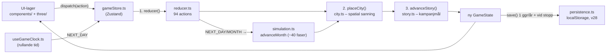
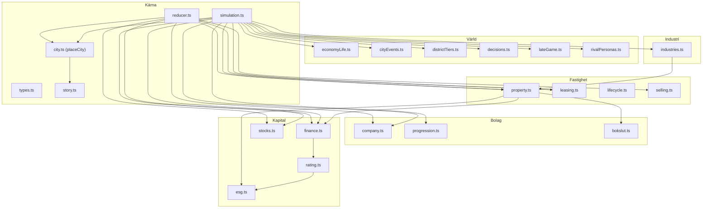

# Fastighetsimperium – systemkarta

Ett kodnära översiktsdokument: alla system i spelet, vilka filer de bor i och
hur de talar med varandra. Tänkt som karta när något ska hittas och justeras.
Filhänvisningar är repo-relativa (klickbara i de flesta editorer/GitHub).

> Håll dokumentet levande: när ett system flyttar eller ett nytt tillkommer,
> uppdatera raden här. Det är billigare än att gissa i en fil på 2 000 rader.

---

## 1. Grundflödet

All logik är **ren och deterministisk** och ligger i `src/engine/`. UI:t
(`src/components/`, `src/three/`) läser bara tillstånd och skickar `actions`.
Det finns exakt **en** väg in i tillståndet: `dispatch`.



**Nyckelrad** (`src/store/gameStore.ts`):
```ts
dispatch: (action) => set((s) => ({ state: placeCity(advanceStory(reducer(s.state, action))) }))
```
Varje action går alltså genom tre steg i tur och ordning:
1. **`reducer`** räknar ut det nya tillståndet (`src/engine/reducer.ts`).
2. **`placeCity`** placerar allt på kartan och är enda källan för vad som står var (`src/engine/city.ts`).
3. **`advanceStory`** bockar av kampanjmål direkt så brev kan dyka upp mitt i en handling (`src/engine/story.ts`).

Tiden drivs av `src/hooks/useGameClock.ts`: kalendern rullar **dag för dag**
(`NEXT_DAY`), och den tunga ekonomin räknas **per månad** i `advanceMonth`
som körs vid månadsskiftet inuti `advanceDay` (`src/engine/simulation.ts`).

---

## 2. De tre naven

Nästan allt hänger på tre filer. Börja alltid här när du letar.

| Nav | Fil | Ansvar | Storlek |
|-----|-----|--------|--------|
| **Tillståndet** | `src/engine/types.ts` | `GameState` + alla 94 `GameAction`-varianter. Sanningen om vad som finns. | ~700 rad |
| **Handlingar** | `src/engine/reducer.ts` | En `case` per action – spelarens klick blir nytt tillstånd. | ~2 100 rad |
| **Månadsloopen** | `src/engine/simulation.ts` | `advanceMonth` – ~40 faser som tickar hela ekonomin. | ~1 400 rad |

Regel att hålla i huvudet: **spelarhandlingar** bor i reducern, **tidens gång**
bor i simuleringen. En hyreshöjning du klickar fram = reducer; hyresgäster som
säger upp sig av sig själva = simulation.

---

## 3. Systemkatalog

Grupperat efter tema. "Talar med" listar de viktigaste beroendena.

### Kärna & loop
| System | Fil(er) | Talar med |
|--------|---------|-----------|
| Domäntyper | `engine/types.ts` | allt |
| Reducer (actions) | `engine/reducer.ts` | simulation, property, leasing, finance, stocks, city, company |
| Månadssimulering | `engine/simulation.ts` | ~allt (se §4) |
| Tillståndsbutik | `store/gameStore.ts` | reducer, city, story, persistence |
| Spelklocka | `hooks/useGameClock.ts` | gameStore (`NEXT_DAY`) |
| Kalender / årstider | `engine/date.ts`, `engine/season.ts` | simulation, UI |
| Slump & id | `engine/random.ts` | generators, simulation, reducer |
| Startvärld | `engine/initState.ts`, `engine/difficulty.ts` | city, generators, data |

### Fastighetsekonomi (en fastighet)
| System | Fil(er) | Talar med |
|--------|---------|-----------|
| Fastighetsformler (NOI, värde, opex, yield) | `engine/property.ts` | simulation, reducer, alla portföljpaneler |
| Uthyrning (ansökningar, kontrakt, nöjdhet) | `engine/leasing.ts` | simulation, reducer, TenantPanel, PortfolioCard |
| Byggnadslivscykel & budkrig | `engine/lifecycle.ts` | simulation (åldrande, obsolescens) |
| Försäljningsmekanik (köpare, paket) | `engine/selling.ts` | reducer, simulation, PortfolioTable |
| Generatorer (hyresgäster, objekt, tomter) | `engine/generators.ts` | initState, simulation, reducer |

### Staden (spatial)
| System | Fil(er) | Talar med |
|--------|---------|-----------|
| Spatial motor (`placeCity`, tomter, kvarter) | `engine/city.ts` | **körs efter varje dispatch**, all rendering |
| Helkvartersbonus | `engine/blocks.ts` | property, simulation, PortfolioCard |
| Distriktsöden (områdesutveckling) | `engine/districtTiers.ts` | property, simulation, DistrictPanel |
| Egen detaljplan | `engine/cityPlan.ts` | reducer, simulation, BuildPanel |
| Markaffärer med privatpersoner (dekorhus) | `engine/landDeals.ts` | reducer, StaticCity (skick/pris) |

### Bolag & förvaltning
| System | Fil(er) | Talar med |
|--------|---------|-----------|
| Bolagsresan (nivåer, kapacitet, overhead) | `engine/company.ts` | simulation, CompanyHub/Panel |
| Progression (forskning, chefer) | `engine/progression.ts` | property (opex), simulation, ResearchPanel/StaffPanel |
| Bolagspolicy + portföljdirektör | `reducer.ts` (`SET_POLICY`/`SET_GLOBAL_MANAGER`), `simulation.ts` (verkställs), `components/PolicyPanel.tsx` | property, leasing, finance, esg |
| Bokslut (resultat/balans) | `engine/bokslut.ts` | company, finance, FinancialStatements |

> **Förvaltning styrs på ETT ställe:** Policy-fliken. Portfölj och Hyresgäster
> visar bara status med "Styr i Policy →". Prioritet: egen förvaltare →
> portföljdirektör → standard. Se §6.

### Finans & kapital
| System | Fil(er) | Talar med |
|--------|---------|-----------|
| Lån, LTV, eget kapital, portföljvärde | `engine/finance.ts` | reducer, simulation, FinancePanel |
| Kreditbetyg (AAA–CCC) + obligationer | `engine/rating.ts` | finance (spread), simulation (covenant), FinancePanel |
| ESG & gröna lån | `engine/esg.ts` | finance, rating, simulation |
| Börsen (aktier, blankning, IPO) | `engine/stocks.ts` | simulation, reducer, StockExchange |

### Industri (parallellt spår, symbios med staden)
| System | Fil(er) | Talar med |
|--------|---------|-----------|
| Industriformler (hotell, energi, logistik) | `engine/industries.ts` | simulation, property (symbios), IndustryPanel |
| Industridata + energiplatser | `engine/industryData.ts` | industries, city (`ENERGY_SITES`), initState |

### Rivaler & slutspel
| System | Fil(er) | Talar med |
|--------|---------|-----------|
| Slutspelet (megaprojekt, fonder, fientligt) | `engine/lateGame.ts` | simulation, reducer, three/MegaProjects |
| Stadsdelsprojekt (signaturkvarter) | `engine/cityProjects.ts` | reducer, simulation, city |
| Rivalpersonligheter (porträtt, repliker) | `engine/rivalPersonas.ts` | simulation, AcquisitionPanel, RivalsPanel |

### Levande ekonomi & händelser
| System | Fil(er) | Talar med |
|--------|---------|-----------|
| Riksbank, flyttkedjor, infrastruktur | `engine/economyLife.ts` | simulation (ränta, vakanstryck) |
| Stadshändelser (mässa, strejk, elkris) | `engine/cityEvents.ts` | industries, property, simulation |
| Beslutshändelser (val spelaren tar) | `engine/decisions.ts` | simulation, reducer, DecisionModal |

### Berättelse, scenarier & data
| System | Fil(er) | Talar med |
|--------|---------|-----------|
| Kampanjen "Arvet efter morfar" | `engine/story.ts` | **körs efter varje dispatch**, StoryProps |
| Scenarier / spellägen | `engine/scenarios.ts`, `engine/difficulty.ts` | initState, reducer |
| Speldata (konstanter, distrikt, uppgraderingar) | `engine/data.ts` | ~allt |
| Format (svenska) | `engine/format.ts` | all UI |

### UI-lager
| System | Fil(er) | Talar med |
|--------|---------|-----------|
| App-skal + fönsterregister | `components/FastighetsImperium.tsx` | alla paneler, uiStore |
| UI-tillstånd (val, öppna fönster) | `store/uiStore.ts` | ParcelNode, alla paneler |
| 3D-stad (rendering) | `three/CityCanvas.tsx` + `three/*` | gameStore, uiStore, city |
| Ljud | `audio/sound.ts` | reducer-effekter, Toolbar |
| Sparning | `store/persistence.ts` | gameStore (v28-migrationer) |

---

## 4. Månadstickens ordning (`advanceMonth`)

Simuleringen kör faserna i **den här ordningen** varje månadsskifte. Vill du
justera *när* något händer, det är här. Radnummer är ungefärliga.

| # | Fas | ~rad |
|---|-----|------|
| 1 | Riksbanken: kvartalsvisa räntebesked | 139 |
| 2 | Fastighetsloopen: slitage, hyresgäster, underhåll, opex | 215 |
| 3 | U1 – ansökningsflödet (pris möter efterfrågan) | 527 |
| 4 | Bolagspolicyn verkställs av cheferna | 597 |
| 5 | Bolagets kontor: overhead & överbelastning | 676 |
| 6 | Industrisektorer – månadsuppdatering | 696 |
| 7 | Politiska val (var 4:e år) | 891 |
| 8 | Distressed rivalförsäljningar | 902 |
| 9 | Rivalrace + konkurrerande bud + rivalfusion | 919–962 |
| 10 | Stadshändelser + distriktshändelser + infrastruktur | 1003–1013 |
| 11 | Slutspelet: kapitalet slår tillbaka | 1053 |
| 12 | Egen detaljplan tickar (samråd/granskning) | 1247 |
| 13 | AI-konkurrenter agerar (portföljer + personligheter) | 1292 |
| 14 | Rivalerna konkurrerar om industriobjekt | 1408 |
| 15 | Bud in/ut på dina & utannonserade fastigheter | 1479–1519 |
| 16 | Börsen + dotterbolag + IPO/uppköpstryck | 1581–1664 |
| 17 | Löner + forskning | 1731–1765 |
| 18 | Områdesutveckling + distriktsöden + helkvarter | 1778–1818 |
| 19 | ESG-betyg + rivalagendor | 1834–1851 |
| 20 | Detaljplaneauktion (kommunen släpper kvarter) | 1868 |
| 21 | Naturlig tillväxt (privata byggherrar förtätar) | 1904 |
| 22 | Beslutshändelse (~6 %) | 1931 |
| 23 | Utgångna listings (hus stannar på kartan) | 1939 |
| 24 | Marknadstillflöde ur världspoolen | 1999 |
| 25 | Covenantvakt (rating + bank följer skulden) | 2052 |
| 26 | Bolagsresan: hint när nästa nivå går att nå | 2095 |

---

## 5. UI-fönster → system

Vilket system ett fönster faktiskt rör (registret finns i
`components/FastighetsImperium.tsx`).

| Fönster | Panelfil | Rör system |
|---------|----------|-----------|
| Bolag | `CompanyHub.tsx` | company, bokslut, progression |
| Policy | `PolicyPanel.tsx` | policy, portföljdirektör, esg, finance |
| Marknad | `MarketPanel.tsx` | generators, selling, property |
| Bygg | `BuildPanel.tsx` | cityPlan, blocks, data |
| Börs | `StockExchange.tsx` | stocks |
| Forskning | `ResearchPanel.tsx` | progression |
| Anställda | `StaffPanel.tsx` | progression, policy (chefsgater) |
| Förvärv | `AcquisitionPanel.tsx` | stocks, rivalPersonas, lateGame |
| Distrikt | `DistrictPanel.tsx` | districtTiers |
| Kalender | `ContractCalendar.tsx` | leasing |
| Hyresgäster | `TenantPanel.tsx` | leasing, policy (spegel) |
| Nyheter | `NewsFeedPanel.tsx` | simulation-loggar |
| Statistik | `StatsPanel.tsx` | statsHistory, districtTiers |
| Industri | `IndustryPanel.tsx` | industries, industryData |
| Portfölj | `PortfolioTable.tsx` / `PortfolioCard.tsx` | property, leasing, selling, policy |
| Finans | `FinancePanel.tsx` | finance, rating, esg |
| Rivaler | `RivalsPanel.tsx` | rivalPersonas, lateGame |

---

## 6. "Var justerar jag X?" – snabbslå

| Vill ändra… | Fil | Var ungefär |
|-------------|-----|-------------|
| Hur snabbt hus slits | `engine/simulation.ts` | fastighetsloopens `np.condition -= rnd(...)` |
| Utgångshyra / ansökningsflöde | `engine/leasing.ts` | `effectiveAskRent`, `applicationRate` |
| NOI, marknadsvärde, opex | `engine/property.ts` | `propNOI`, `propMarketValue`, `propAnnualOpex` |
| Lånevillkor, ränta-spread | `engine/finance.ts` + `engine/rating.ts` | `loanTerms`, `RATING_SPREAD` |
| Räntebana (Riksbanken) | `engine/economyLife.ts` | `policyRateTarget`, `RATE_STEP` |
| Startkapital / startbestånd | `engine/initState.ts` + `engine/difficulty.ts` | presets |
| Priser i finansdistriktet m.m. | `engine/generators.ts` + `engine/data.ts` | prisgolv per distrikt |
| Bolagsnivåernas krav & kapacitet | `engine/company.ts` | `TIERS` |
| Industriintäkter (hotell/energi/logistik) | `engine/industries.ts` | resp. `...MonthlyRevenue` |
| Förvaltningens regler (underhåll/uthyrning) | `engine/simulation.ts` fas 2 & 4 + `components/PolicyPanel.tsx` | effektiva trösklar |
| Rivalernas beteende | `engine/simulation.ts` fas 13–14 + `engine/rivalPersonas.ts` | AI-loopen |
| Tempo / hastigheter | `hooks/useGameClock.ts` | `MONTH_MS`, `ROLL_SPEED` |
| Kartans utseende per hustyp | `three/districtBuildings.tsx` | familjekomponenterna |
| Var saker står på kartan | `engine/city.ts` (+ `ENERGY_SITES` i `engine/industryData.ts`) | `placeCity`, zoner, energiplatser |

---

## 7. Beroendekarta (systemnivå)



---

*Underhåll: uppdatera §3-raden och §4-fasen när ett system flyttar eller
tillkommer. Radnummer i §4 driftar – sök hellre på fas­kommentaren (`── Fas ──`).*
